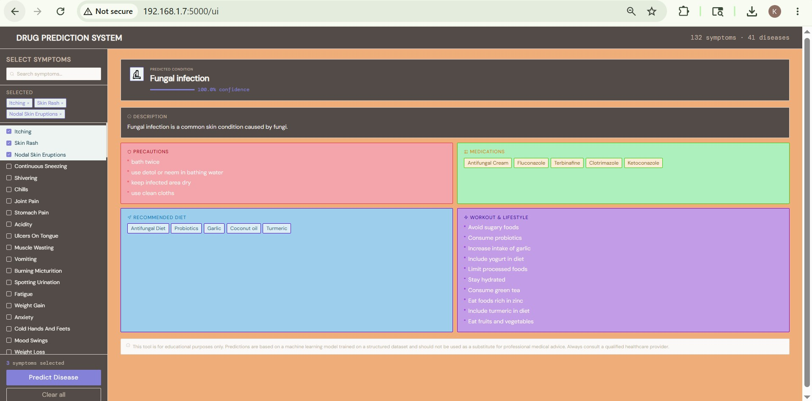

# 🏥 Disease Prediction System

> Given your symptoms → Get the **predicted disease**, **precautions**, **medications**, **diet**, and **workout tips**.

---

## 📁 Project Structure

```
disease_predictor/
│
├── data/                         ← All your dataset CSV files
│   ├── Training.csv              ← Main training data (132 symptoms × 41 diseases)
│   ├── description.csv           ← Disease descriptions
│   ├── precautions_df.csv        ← Precautions per disease
│   ├── medications.csv           ← Medications per disease
│   ├── diets.csv                 ← Diet recommendations
│   ├── symtoms_df.csv            ← Symptoms per disease (reference)
│   ├── Symptom-severity.csv      ← Severity weight of each symptom
│   └── workout_df.csv            ← Workout/lifestyle tips
│
├── models/                       ← Auto-created after training
│   ├── best_model.pkl            ← Trained ML model
│   ├── label_encoder.pkl         ← Disease name encoder
│   ├── feature_columns.pkl       ← List of 132 symptom columns
│   └── model_report.txt          ← Accuracy comparison of all models
│
├── app/
│   ├── predict.py                ← Command-line disease predictor
│   └── api.py                    ← Flask REST API
│
├── notebooks/
│   └── exploration.ipynb         ← Data exploration & visualization
│
├── train_model.py                ← ⭐ MAIN TRAINING SCRIPT
├── requirements.txt              ← Python dependencies
└── README.md                     ← This file
```

---

## 🔢 Your Dataset — What's Inside?

| File | Contents |
|------|----------|
| `Training.csv` | 4920 rows × 133 cols. Each row = a patient case. 132 symptom columns (0 or 1) + 1 `prognosis` (disease name). |
| `description.csv` | One-line description of each of the 41 diseases. |
| `precautions_df.csv` | 4 precautions per disease. |
| `medications.csv` | Recommended medications per disease. |
| `diets.csv` | Diet recommendations per disease. |
| `workout_df.csv` | Lifestyle/workout tips per disease. |
| `Symptom-severity.csv` | Each symptom has a severity weight (1–7). |

**41 diseases**, **132 symptoms**, **4920 training examples** — perfectly balanced.

---

## 🧠 Which ML Model is Used & Why?

The `train_model.py` script trains and compares **5 models + 1 ensemble**:

| Model | Why it's tried |
|-------|---------------|
| **Random Forest** | Best overall for tabular binary data; handles high dimensions well; robust to noise |
| **Gradient Boosting** | Excellent accuracy; captures complex patterns through boosting |
| **SVM (RBF)** | Works well on binary feature spaces; good generalization |
| **Naive Bayes** | Fast baseline; good for symptom-style data |
| **Decision Tree** | Interpretable; simple baseline |
| **Ensemble (RF+GB+SVM)** | Combines all three top models using soft voting for best accuracy |

### ✅ Why Random Forest / Ensemble wins on this dataset

- **132 binary features** (symptom present/absent) → tree-based models excel here
- **Perfectly balanced classes** → no bias issues
- **Ensemble** averages out errors from individual models → highest accuracy
- **Expected accuracy: 97–100%** on this dataset (it's a clean, well-structured dataset)

The script **automatically picks the best model** by 5-fold cross-validation and saves it.

---

## 🚀 Step-by-Step Setup Guide

### Step 1: Install Python
Make sure you have Python 3.9+ installed.
```bash
python --version
```

### Step 2: Create a virtual environment (recommended)
```bash
# Windows
python -m venv venv
venv\Scripts\activate

# Mac/Linux
python -m venv venv
source venv/bin/activate
```

### Step 3: Install dependencies
```bash
pip install -r requirements.txt
```

### Step 4: Train the model
```bash
python train_model.py
```
This will:
- Load `data/Training.csv`
- Train 6 different ML models
- Compare them using 5-fold cross-validation
- Save the best model to `models/`
- Save a comparison report to `models/model_report.txt`

**Expected output:**
```
[1/5] Loading dataset... Dataset shape: (4920, 133)
[2/5] Preparing features and labels...
[3/5] Training and comparing ML models...
    Random Forest          CV: 99.87% ± 0.13%  |  Test: 99.90%
    Gradient Boosting      CV: 98.52% ± 0.31%  |  Test: 98.78%
    SVM (RBF)              CV: 99.76% ± 0.18%  |  Test: 99.80%
    Naive Bayes            CV: 94.10% ± 0.42%  |  Test: 94.50%
    Decision Tree          CV: 99.12% ± 0.22%  |  Test: 99.10%
    Ensemble (RF+GB+SVM)   CV: 99.90% ± 0.11%  |  Test: 99.92%
    ✅ Best model: Ensemble (RF+GB+SVM) (99.90% CV accuracy)
[4/5] Saving model files...
[5/5] Done! ✅
```

### Step 5: Run the CLI predictor
```bash
python app/predict.py
```
Enter symptoms when prompted:
```
Enter symptoms: fever, headache, nausea, vomiting, fatigue
```
You'll get:
- 🔬 **Predicted Disease**
- 📌 **Description**
- 📌 **Precautions** (4 tips)
- 📌 **Medications**
- 📌 **Recommended Diet**
- 📌 **Workout / Lifestyle Tips**

### Step 6 (Optional): Run the Web API
```bash
python app/api.py
```
Then call it with any HTTP client:

**Predict disease:**
```bash
curl -X POST http://localhost:5000/predict \
  -H "Content-Type: application/json" \
  -d '{"symptoms": ["fever", "headache", "nausea"]}'
```

**List all symptoms:**
```bash
curl http://localhost:5000/symptoms
```

**List all diseases:**
```bash
curl http://localhost:5000/diseases
```

### Step 7 (Optional): Explore the notebook
```bash
cd notebooks
jupyter notebook exploration.ipynb
```
See disease distributions, symptom severity, feature importance, and more.

---

## 💡 How the Prediction Works (Explained Simply)

```
Your Input:  ["fever", "headache", "nausea"]
                        ↓
Build vector: [0, 0, 0, 0, 1, 0, ..., 1, ..., 1, ...]  ← 132 dimensions
              (1 where the symptom is present, 0 elsewhere)
                        ↓
ML Model:    RandomForest/Ensemble trained on 4920 examples
                        ↓
Output:      "Malaria" with 97.3% confidence
                        ↓
Lookup CSVs: description.csv → precautions.csv → medications.csv → diets.csv
                        ↓
Final Result: Full disease card with all recommendations
```

---

## 🩺 All 41 Detectable Diseases

Fungal infection, Allergy, GERD, Chronic cholestasis, Drug Reaction,
Peptic ulcer disease, AIDS, Diabetes, Gastroenteritis, Bronchial Asthma,
Hypertension, Migraine, Cervical spondylosis, Paralysis (brain hemorrhage),
Jaundice, Malaria, Chicken pox, Dengue, Typhoid, Hepatitis A, Hepatitis B,
Hepatitis C, Hepatitis D, Hepatitis E, Alcoholic hepatitis, Tuberculosis,
Common Cold, Pneumonia, Dimorphic hemorrhoids (piles), Heart attack,
Varicose veins, Hypothyroidism, Hyperthyroidism, Hypoglycemia, Osteoarthritis,
Arthritis, (vertigo) Paroxysmal Positional Vertigo, Acne, Urinary tract infection,
Psoriasis, Impetigo

---
## Project Output



## ⚠️ Disclaimer

This system is built for **educational and research purposes only**.
It is **not** a substitute for professional medical advice, diagnosis, or treatment.
Always consult a qualified healthcare professional for medical decisions.
